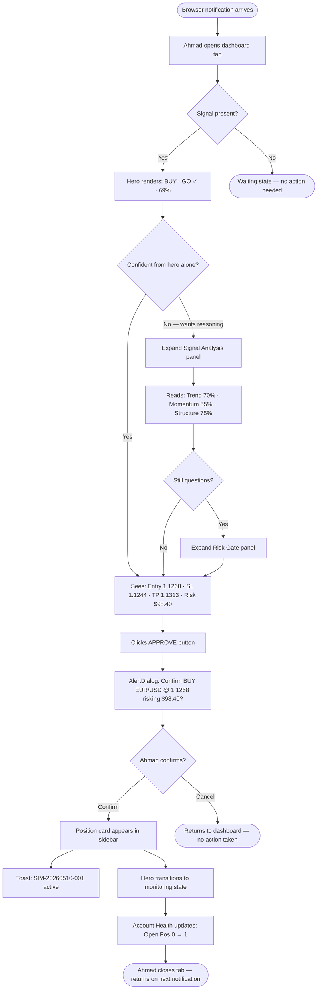
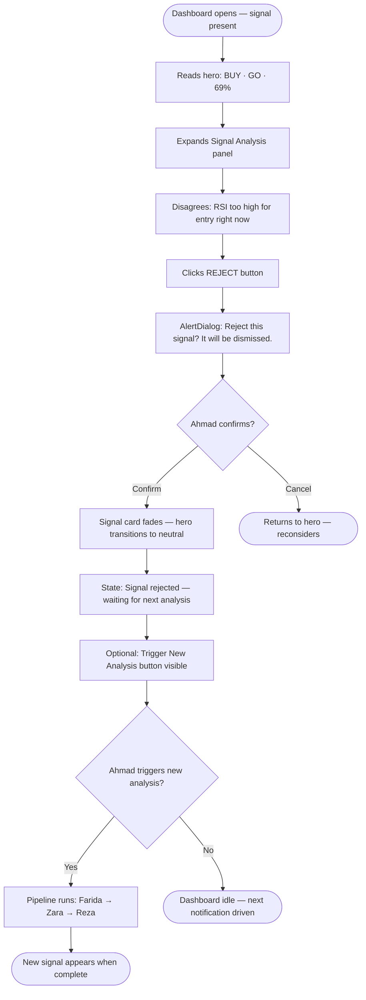
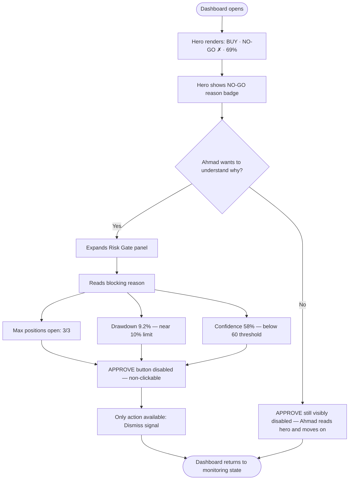
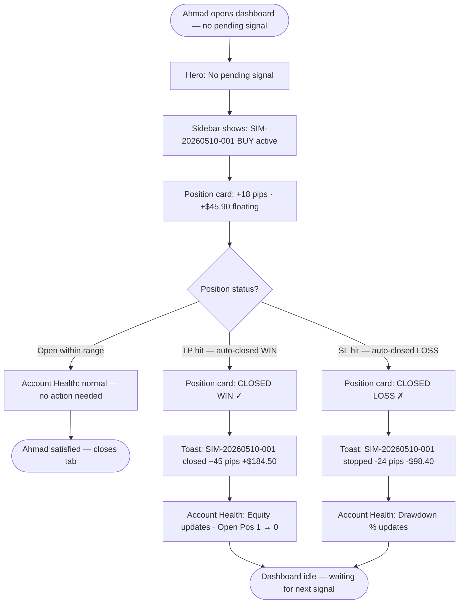

# UX Design Specification AI-powered Forex Automation System

**Author:** AhmadAlkhatami
**Date:** 2026-05-10

---

<!-- UX design content will be appended sequentially through collaborative workflow steps -->

## Executive Summary

### Project Vision

A personal web-based trading dashboard that surfaces AI agent analysis instantly
when a signal is triggered. The user (solo trader, intermediate level) opens the
dashboard on-demand to review the pipeline output and take action — triggering
new analysis, approving/rejecting trade signals, and monitoring active positions.
The design prioritizes instant decision readability over feature richness.

### Target Users

**Primary: AhmadAlkhatami — Solo Trader**

- Intermediate experience with forex trading (EUR/USD, M15/H1)
- Opens dashboard reactively (notification-driven, not continuous monitoring)
- Needs to understand AI reasoning before acting — not a blind executor
- Operates in Simulation mode; may transition to Live in the future
- Single user — no auth/role complexity needed

### Key Design Challenges

1. **Instant decision readability**: Critical info (signal direction + GO/NO-GO)
   must be scannable in under 2 seconds — no scrolling on landing
2. **Reasoning transparency without overwhelm**: Agent rationale available
   but collapsed by default — expand only when trust is needed
3. **Action safety**: Approve/Reject are consequential; SIMULATION vs LIVE
   mode must be unmistakably distinct across the entire UI

### Design Opportunities

1. **Simplified pipeline view**: Collapse 4 agents into 2 panels —
   "Signal Analysis" (Farida + Zara) and "Risk Gate" (Reza) — cleaner
   than 4 individual agent cards
2. **Signal-first hero**: Top of page = direction + GO/NO-GO + confidence.
   No hunting, no scrolling.
3. **Minimal approve flow**: Dashboard open → read hero → expand if needed
   → one confirm → done
4. **Dominant mode badge**: Full-width SIMULATION banner, color shift for LIVE

### Simplified Dashboard Structure (Occam's Razor Applied)

**Core elements — non-negotiable:**

- Signal direction + GO/NO-GO (hero section)
- Trade parameters: Entry, SL, TP, Lot, Risk $, R/R
- Approve / Reject action
- SIMULATION vs LIVE indicator
- Account health: Equity, Drawdown %, Open Positions
- Active positions: Floating P&L, distance to SL/TP

**Moved to secondary (collapsed/separate page):**

- Agent reasoning detail → collapsible panels
- Layer score breakdown (Zara) → inside collapsed panel
- Trade history / execution log → separate page

## Core User Experience

### Defining Experience

The core loop of this dashboard is a single, repeatable action:
**Read signal → Assess reasoning → Approve or Reject.**
Every design decision must serve this loop. The dashboard succeeds when Ahmad
can complete this loop confidently in under 60 seconds from opening the page.

### Platform Strategy

- **Platform**: Web browser, desktop-first
- **Input**: Mouse and keyboard — no touch optimization needed
- **Connectivity**: Always-online; no offline mode required
- **Browser**: Modern browsers (Chrome/Firefox/Safari); no IE support
- **Screen**: Optimized for 1280px+ width; single-page layout, no multi-tab flow

### Effortless Interactions

These must require zero conscious effort:

1. **Reading the decision**: GO/NO-GO + signal direction visible immediately
   on page load — no scroll, no click to reveal
2. **Reading trade parameters**: Entry, SL, TP, Lot, Risk $ visible in one glance
   below the hero — no modal, no extra click
3. **Approving**: Single button click + one confirm dialog — done

These should have intentional friction (to prevent mistakes):

1. **Rejecting**: Confirm dialog with reason field (optional) — slight pause
2. **Switching to LIVE mode**: Separate settings page with explicit warning step

### Critical Success Moments

1. **The 2-second scan**: First thing Ahmad sees on load is the hero section —
   BUY/SELL/HOLD + GO/NO-GO + confidence. He knows what to do immediately.
2. **The confident approve**: After reading parameters (10–20 seconds), Ahmad
   clicks Approve with conviction — not anxiety. The UI communicates calm
   intelligence, not urgency or alarm.
3. **The instant feedback**: After approval, the position appears in the
   Positions section immediately — visual proof the action was registered.
4. **The safe rejection**: When Ahmad rejects, the dashboard returns to a
   neutral "waiting for next signal" state — no lingering UI clutter.

### Experience Principles

1. **Decision first** — The most critical information (signal + decision) is
   always at the top, always visible on load. Nothing competes with it.
2. **Trust through transparency** — Agent reasoning is available on demand
   (collapsed panels) but never forced. Ahmad chooses when to go deeper.
3. **Calm intelligence** — The UI presents analysis with confidence, not alarm.
   Colors signal importance without panic. No blinking, no red flashing.
4. **Safe to act** — SIMULATION mode is unmistakable (full-width banner).
   Consequential actions (Approve/Switch to LIVE) always require confirmation.

## Desired Emotional Response

### Primary Emotional Goals

The dashboard must make Ahmad feel **confident, clear, and in control** —
not pressured, not overwhelmed, not anxious. This is an advisory tool, not
an alarm system. Every design decision reinforces calm, professional intelligence.

**Primary:** Confidence — "I understand exactly what the AI is telling me and
I can act decisively."

**Secondary:** Control — "I am the final decision-maker. The AI advises; I act."

**Tertiary:** Satisfaction — "The loop is complete. The system responded to
my action."

### Emotional Journey Mapping

| Moment | Target Emotion | Design Trigger |
|--------|---------------|----------------|
| Open dashboard (notification) | **Focused** — I know why I'm here | Single-purpose layout, no noise |
| Read hero section (BUY + GO) | **Clarity** — I immediately know the signal | Signal + decision in <2 seconds |
| Open collapsed reasoning | **Trust** — The AI considered everything | Transparent, structured breakdown |
| Read trade parameters | **Confident** — I know exactly my risk | Clear numbers, R/R, risk $ |
| Click Approve | **Decisive** — Action without hesitation | Single button, no cognitive load |
| See position appear | **Satisfied** — Loop complete, system responded | Instant feedback in Positions |
| Monitor active position | **In control** — I hold the reins | Live P&L, SL/TP distance visible |

### Micro-Emotions

| Pair | Target State | Why |
|------|-------------|-----|
| Confidence vs. Confusion | **Confidence** | Clear visual hierarchy, no ambiguity |
| Trust vs. Skepticism | **Qualified Trust** | Reasoning on demand — not blind faith |
| Calm Excitement vs. Anxiety | **Calm Excitement** | Especially in SIMULATION — lower stakes |
| Satisfaction vs. Delight | **Satisfaction** | Professional tool, not a game |
| Decisive vs. Hesitant | **Decisive** | Parameters visible before action |

### Emotions to Avoid

- **Anxiety** before approve/reject — remove countdown timers, no urgency language
- **Confusion** about signal direction — never show ambiguous colors or labels
- **FOMO / Pressure** — no "act now" messaging, no time pressure indicators
- **Overwhelm** — reasoning collapsed by default, trade history on separate page
- **Regret** from accidental actions — confirmation dialogs on all consequential actions

### Design Implications

1. **Confidence → Clear visual hierarchy**: Signal direction uses large,
   unambiguous typography. GO = green, NO-GO = red. No grey areas.
2. **Control → Approve/Reject always visible**: Never hidden behind scroll
   or modal chains. Always present below trade parameters.
3. **Calm intelligence → Muted color palette**: No red flashing, no blinking,
   no urgent animations. Colors signal state, not alarm.
4. **Trust → Reasoning on demand**: Collapsed panels labeled with agent names
   (Signal Analysis, Risk Gate) — open when needed, closed by default.
5. **Satisfaction → Instant feedback**: After approve, position card appears
   immediately in the Positions section — visual proof of action.

### Emotional Design Principles

1. **Advisory, not imperative** — The UI presents analysis as a recommendation,
   not a command. Ahmad is always the decision-maker.
2. **Calm over urgent** — Typography, spacing, and colors communicate
   professionalism and stability, never panic or excitement.
3. **Transparency builds trust** — Agent reasoning is accessible but optional.
   The more Ahmad explores, the more he trusts.
4. **Closure matters** — Every action has clear confirmation feedback.
   No ambiguous states where Ahmad wonders "did that work?"

## UX Pattern Analysis & Inspiration

### Inspiring Products Analysis

**Stockbit (Primary Inspiration)**

Indonesian stock investing platform used actively by Ahmad. Key UX strengths:

- **Scannable portfolio view**: Performance summary visible at a glance —
  no scrolling to understand current state
- **Strict color consistency**: Green = positive/up, Red = negative/down,
  applied universally without exception across the entire interface
- **Card-based information architecture**: Each data type lives in its own
  card — portfolio, watchlist, news, stock detail — digestible and modular
- **Progressive disclosure**: Portfolio → stock summary → stock detail →
  order book. User controls depth of information
- **Prominent number display**: Prices and percentages use large, bold
  typography — financial data is the hero, not supporting content
- **Accessible action buttons**: Buy/Sell always visible and prominent,
  never hidden behind navigation

### Transferable UX Patterns

**Adopt directly:**

1. **Strict color system** (from Stockbit) — BUY = green, SELL = red,
   GO = green, NO-GO = red. Never deviate. Color is the fastest signal
   channel. Applied to: hero section, action buttons, position cards.

2. **Card-based layout** (from Stockbit) — Signal Analysis panel,
   Risk Gate panel, Trade Parameters card, Positions card. Each section
   self-contained. Applied to: main dashboard layout.

3. **Prominent number typography** (from Stockbit) — Entry price, SL, TP,
   Risk $ displayed in large bold type. Numbers are the product.
   Applied to: trade parameters section.

4. **Progressive disclosure** (from Stockbit) — Hero shows decision summary,
   panels collapsed by default, user expands for reasoning detail.
   Applied to: Signal Analysis + Risk Gate collapsed panels.

**Adapt for our context:**

1. **Action buttons** — Stockbit's Buy/Sell adapted to Approve/Reject.
   Key difference: add confirmation dialog (Stockbit skips this for speed;
   we add it for safety in a semi-automated context).

2. **Portfolio summary** → **Account Health bar** — Stockbit's portfolio
   header adapted into a compact status bar: Equity | Drawdown % | Open Pos.

### Anti-Patterns to Avoid

1. **Social feed noise** — Stockbit mixes social posts with financial data.
   Our dashboard is pure data — no social, no news feed, no clutter.

2. **Tab overload** — Stockbit has many tabs (Portofolio, Watchlist, Explore,
   Feed, etc.). Our dashboard is single-page, single-purpose. Maximum
   one secondary page (Trade History).

3. **Mobile-first crowding** — Stockbit's web version can feel dense because
   it's adapted from mobile. We design desktop-first with proper whitespace.

4. **Auto-refresh visual noise** — Price tickers that flash on every update.
   Our data updates smoothly without drawing attention to the refresh itself.

### Design Inspiration Strategy

**What to Adopt:**

- Stockbit's color system → our signal direction + decision colors
- Stockbit's card architecture → our dashboard section structure
- Stockbit's number typography → our trade parameter display

**What to Adapt:**

- Stockbit's action prominence → add confirmation layer for safety
- Stockbit's portfolio header → compact account health bar

**What to Avoid:**

- Social/feed elements → not relevant to solo trading tool
- Mobile-first density → we have desktop space, use it with whitespace
- Excessive tabs/navigation → single-page, one secondary route max

## Design System Foundation

### Design System Choice

**Stack: Tailwind CSS + shadcn/ui + Tremor**

- **Tailwind CSS** — Utility-first styling foundation. Provides consistent
  spacing, typography, and color tokens without writing custom CSS.
- **shadcn/ui** — Copy-paste React component primitives (Button, Dialog,
  Collapsible, Badge, Card). Components are owned by the project — fully
  modifiable, no library lock-in.
- **Tremor** — Dashboard-specific React components (Metric cards, Status
  badges, KPI display, Charts). Built on Tailwind. Exactly fits the
  financial data display needs of this project.

### Rationale for Selection

1. **Ownership over abstraction**: shadcn/ui components live in the codebase
   — no black-box library behavior. Ahmad can modify any component directly.
2. **Dashboard-native**: Tremor's metric cards and status badges map 1:1 to
   our data: signal confidence %, drawdown %, floating P&L.
3. **Stockbit-aligned aesthetics**: Tailwind's clean typography and card
   system mirrors Stockbit's visual language naturally.
4. **Dark mode built-in**: Tailwind's dark: variant + shadcn/ui's theme
   system supports light/dark toggle without extra libraries.
5. **Solo developer friendly**: shadcn/ui CLI (`npx shadcn-ui add button`)
   makes adding components fast — no full library installation needed.

### Implementation Approach

**Tech stack:**

- React 18+ with Next.js 14 (App Router)
- Tailwind CSS 3.4+
- shadcn/ui (installed via CLI, components in `/components/ui/`)
- Tremor 3.x (for metric cards, charts, badges)
- Recharts (bundled with Tremor for P&L charts if needed)

**Project structure:**

```
src/
├── app/
│   ├── page.tsx               # Main dashboard
│   └── history/page.tsx       # Trade history (secondary page)
├── components/
│   ├── ui/                    # shadcn/ui primitives
│   ├── dashboard/
│   │   ├── SignalHero.tsx
│   │   ├── SignalAnalysisPanel.tsx
│   │   ├── RiskGatePanel.tsx
│   │   ├── TradeParameters.tsx
│   │   ├── ApproveRejectActions.tsx
│   │   ├── AccountHealth.tsx
│   │   └── PositionsCard.tsx
│   └── layout/
│       ├── SimulationBanner.tsx
│       └── Header.tsx
└── lib/
    └── api.ts                 # Calls to ForexAI.API backend
```

### Customization Strategy

**Color tokens (Tailwind config):**

- `signal-buy`: green-500 / green-400 (dark)
- `signal-sell`: red-500 / red-400 (dark)
- `signal-hold`: gray-400
- `decision-go`: emerald-600
- `decision-nogo`: red-600
- `simulation-banner`: amber-400 — full-width, unmistakable
- `live-banner`: red-700 — high-contrast warning

**Typography:**

- Numbers (price, P&L, risk $): `font-mono font-bold text-2xl` — Stockbit style
- Labels: `text-sm text-muted-foreground` — supporting, not competing
- Signal direction: `text-4xl font-black` — hero, largest element on page

**Component rules:**

- Cards: `rounded-lg border bg-card shadow-sm` (shadcn/ui default)
- Collapsed panels: shadcn/ui `Collapsible` component
- Confirm dialogs: shadcn/ui `AlertDialog` for Approve/Reject
- Status badges: Tremor `Badge` with color variants

## Defining Core Experience

### Defining Experience

**"Read the AI signal → Approve or Reject in one confident action."**

This is the defining interaction of the dashboard. Like Stockbit's Buy/Sell
flow, if we nail this single loop — Ahmad opens, reads, acts, closes in
under 60 seconds — everything else follows. Every other feature exists to
support this moment.

### User Mental Model

Ahmad approaches this dashboard as a **senior trader reviewing a junior
analyst's pitch**. The AI (Farida + Zara + Reza) presents the analysis;
Ahmad makes the final call. This mental model has two implications:

1. **The AI must show its work** — Ahmad doesn't blindly trust a recommendation.
   He wants to see the reasoning (MA alignment, RSI direction, support level)
   before acting. Collapsed panels satisfy this: available, not forced.
2. **Ahmad is always in control** — The system never auto-executes.
   Approve and Reject are always explicit human actions with confirmation.

**Current pain point with manual trading**: Doing MA + RSI + S/R analysis
manually on TradingView takes 10–15 minutes per signal. This dashboard
compresses that to a 10-second read — Ahmad verifies rather than calculates.

### Success Criteria

The core experience is successful when:

1. **Speed**: Ahmad completes the full loop (open → read → act) in under
   60 seconds — faster than manual analysis, not faster than safe decision-making
2. **Zero ambiguity**: At no point does Ahmad wonder "what does this mean?"
   or "what should I do now?" — direction and action are always clear
3. **Confident action**: Ahmad clicks Approve with conviction, not anxiety —
   the UI has given him enough information to feel certain
4. **Instant closure**: After approve, a position card appears immediately —
   Ahmad knows the action registered without checking a separate page
5. **Safe rejection**: When Ahmad rejects, the dashboard returns cleanly to
   "waiting for next signal" — no lingering UI debt

### Novel vs. Established Patterns

**Established (use directly):**

- Card-based data display — familiar from Stockbit, no education needed
- Button + confirm dialog for consequential actions — universal pattern
- Collapsible accordion for detail — familiar from every modern web app
- Color coding for direction (green/red) — universal in finance UIs

**Novel (unique to this product):**

- **AI reasoning chain as collapsible panels** — No standard trading app
  shows agent-level reasoning (Farida's trend score, Zara's layer analysis,
  Reza's validation gates). This is a unique trust-building pattern.
  Implementation: accordion panels labeled "Signal Analysis" and "Risk Gate"
  with structured breakdown inside — familiar container, novel content.
- **Mode-aware full-UI treatment** — Full-width amber banner for SIMULATION
  is more aggressive than typical "badge" patterns, but necessary for safety.

### Experience Mechanics

**1. Initiation**

- Trigger: Notification (browser/OS) arrives when new signal is generated
- Ahmad opens browser tab → dashboard loads → hero section renders first
- No login, no onboarding — single-user tool, straight to the signal

**2. Interaction Flow**

```
Eyes → Hero (BUY + GO + 69% confidence)          [~2 seconds]
       ↓ (optional)
     Expand "Signal Analysis" panel               [~10 seconds reading]
     Expand "Risk Gate" panel                     [~5 seconds reading]
       ↓
     Eyes → Trade Parameters card                 [~5 seconds]
     (Entry 1.1268 | SL 1.1244 | TP 1.1313 | Lot 0.41 | Risk $98.40)
       ↓
     Click [APPROVE] button
```

**3. Feedback**

- AlertDialog: "Confirm trade: BUY EUR/USD @ 1.1268, risking $98.40 (0.98%)"
  → [Confirm] or [Cancel]
- On confirm: position card animates into Positions section immediately
- Toast: "Position opened — SIM-20260510-001 active"
- Hero section transitions to "Signal processed — monitoring position"

**4. Completion**

- Dashboard shows: active position with live floating P&L, distance to SL/TP
- Account Health bar updates: Open Positions 0 → 1, Used Risk $0 → $98.40
- Next state: "waiting for next signal" + monitoring current position
- Ahmad closes the tab — returns when next notification arrives

## Visual Design Foundation

### Color System

**Mode**: Light + Dark (user-toggled via shadcn/ui theme system)

**Semantic Color Tokens:**

| Token | Light | Dark | Usage |
|-------|-------|------|-------|
| Background | white | slate-950 | Page background |
| Card | slate-50 | slate-900 | Panel backgrounds |
| Border | slate-200 | slate-800 | Card borders |
| Text primary | slate-900 | slate-50 | Main content |
| Text muted | slate-500 | slate-400 | Labels, secondary |
| BUY / GO | emerald-600 | emerald-400 | Signal hero, approve btn |
| SELL / NO-GO | red-600 | red-400 | Signal hero, reject btn |
| HOLD / neutral | slate-500 | slate-400 | Inactive state |
| SIMULATION banner | amber-400 | amber-400 | Always full-width top |
| LIVE banner | red-700 | red-600 | Full-width, high contrast |

**Accessibility**: All color pairs meet WCAG AA (4.5:1 contrast ratio minimum).
emerald-600 on white = 4.6:1 ✅ · red-600 on white = 5.2:1 ✅

### Typography System

**Fonts:**

- **Display + UI**: `Inter` (via `next/font/google`) — clean, professional,
  excellent readability at small sizes. Matches Stockbit's feel.
- **Numbers**: `JetBrains Mono` — monospaced for price alignment and
  financial data. Prices in mono prevent layout shift on updates.

**Type scale:**

| Role | Class | Usage |
|------|-------|-------|
| Signal direction | `text-5xl font-black` | Hero: "BUY" / "SELL" |
| Decision label | `text-2xl font-bold` | "GO ✓" / "NO-GO ✗" |
| Trade parameters | `text-2xl font-mono font-bold` | 1.1268, $98.40 |
| Panel titles | `text-sm font-semibold uppercase tracking-wider` | "SIGNAL ANALYSIS" |
| Body content | `text-sm leading-relaxed` | Reasoning text in panels |
| Muted labels | `text-xs text-muted-foreground` | "Entry price", "Stop Loss" |

### Spacing & Layout Foundation

**Layout structure (desktop 1280px+):**

```
┌─────────────────────────────────────────────────────┐
│  [SIMULATION BANNER — full width, amber-400]         │
├─────────────────────────────────────────────────────┤
│  Header: EUR/USD · M15 · London Open  [▼ trigger]   │
├──────────────────────────┬──────────────────────────┤
│                          │                          │
│  MAIN COLUMN (65%)       │  SIDEBAR (35%)           │
│                          │                          │
│  Signal Hero card        │  Account Health card     │
│  Signal Analysis panel   │  Active Positions card   │
│  Risk Gate panel         │                          │
│  Trade Parameters card   │                          │
│  Approve / Reject        │                          │
│                          │                          │
└──────────────────────────┴──────────────────────────┘
```

**Spacing tokens:**

| Context | Value | Class |
|---------|-------|-------|
| Card padding | 24px | `p-6` |
| Section gap | 16px | `gap-4` |
| Component gap | 12px | `gap-3` |
| Page horizontal padding | 32px | `px-8` |
| Max content width | 1280px | `max-w-7xl mx-auto` |

**Layout principles:**

1. **Main column for decision flow** — signal → analysis → parameters →
   action reads top-to-bottom without interruption
2. **Sidebar for ambient context** — account health and positions are
   important but not part of the decision flow
3. **No horizontal scrolling** — all content fits 1280px+ desktop viewport
4. **Generous card padding** — `p-6` ensures financial numbers breathe

### Accessibility Considerations

1. **Color not sole indicator**: Signal uses both color AND text ("BUY" not
   just green) — supports color-blind users
2. **Focus states**: shadcn/ui focus rings preserved for keyboard navigation
3. **Contrast ratios**: All text meets WCAG AA (4.5:1) minimum
4. **Reduced motion**: Animations respect `prefers-reduced-motion`
5. **Minimum font size**: `text-sm` (14px) across all readable content

## Design Direction Decision

### Selected Direction: A — Signal Command

**Choice rationale:**

Ahmad selected **Direction A: Signal Command** from the four showcased options.
This direction is the strongest fit because it directly mirrors the Stockbit
mental model he uses daily: scannable hero metric, card-based sections,
green/red color-coded actions.

### Direction A Definition

| Attribute | Value |
|-----------|-------|
| Layout | 2-column: main decision flow (65%) + ambient sidebar (35%) |
| Inspiration | Stockbit (Indonesian stock platform) |
| Style | Clean, professional, high information density without clutter |
| Theme | Light default, dark toggle |
| Typography | Inter for UI, JetBrains Mono for numbers |

### Core Layout Pattern

```
[SIMULATION MODE BANNER — full-width amber]
┌────────────────────────────┬─────────────────────────┐
│  Signal Hero               │  Account Health         │
│  BUY | GO ✓ | 69%         │  Equity | Drawdown | Pos │
├────────────────────────────┤                         │
│  ▶ Signal Analysis panel   │  Active Positions       │
│  ▶ Risk Gate panel         │  SIM-20260510-001       │
│  Trade Parameters card     │  +12 pips / +$38.20     │
│  [APPROVE]    [REJECT]     │                         │
└────────────────────────────┴─────────────────────────┘
```

### What Makes Direction A Right for This Product

1. **Hero-first readability** — BUY/SELL + GO/NO-GO visible immediately
   without scrolling. Decision in 2 seconds, like Stockbit's portfolio view.
2. **Collapsed panels by default** — Signal Analysis and Risk Gate are there
   when Ahmad wants depth, hidden when he trusts the headline. Occam's Razor
   applied: don't force information, surface it on demand.
3. **Sidebar ambient monitoring** — Account health and open positions always
   visible without breaking the decision flow. Parallel awareness.
4. **Full-width mode banner** — SIMULATION amber stripe is unmistakable.
   Ahmad never forgets whether he's in sim or live — safety by design.
5. **Numbers as hero** — Monospace bold typography for prices (1.1268, $98.40)
   mirrors Stockbit's treatment of financial data as primary content.

## User Journey Flows

### Journey 1: Signal Review & Approve (Golden Path)

The primary interaction loop — must complete in under 60 seconds.



**Key design decisions:**

- Optional panel expansion (step E) = progressive disclosure working correctly
- AlertDialog confirm = safety gate for consequential actions
- Immediate position card = instant feedback, zero latency perception
- Ahmad closes tab = notification-driven usage pattern respected

---

### Journey 2: Signal Review & Reject

When Ahmad disagrees with the AI signal.



**Key design decisions:**

- Rejection also requires confirm dialog — prevents mis-click on consequential action
- Post-reject state is unambiguous: clear next action visible (Trigger New or wait)
- Ahmad controls analysis cadence — system does not auto-retry

---

### Journey 3: NO-GO Risk Gate

When Reza blocks the trade — risk gate returns NO-GO.



**Key design decisions:**

- APPROVE button **disabled, not hidden** — transparent system; Ahmad knows it exists but system blocks it
- NO-GO reason badge visible in hero without requiring panel expand
- No "override" mechanism — hard limits are hard; UI enforces, never tempts

---

### Journey 4: Position Monitoring

Ahmad checks active position status with no pending new signal.



**Key design decisions:**

- Dashboard has value even with no pending signal — position monitoring justifies opening
- Auto-close (SL/TP hit) communicates via toast even if Ahmad wasn't watching
- CLOSED WIN / CLOSED LOSS use green/red card treatment — instant visual comprehension

---

### Journey Patterns

Three reusable patterns extracted across all journeys:

**Pattern 1: Decision Gate**

```
Trigger → Hero reads (2s) → [Optional] Expand detail panel →
Action button → AlertDialog confirm → Result + toast feedback
```

Applied in: Journey 1 (Approve), Journey 2 (Reject).
Rule: All consequential actions require a confirm dialog — no one-click commits.

**Pattern 2: Hard Block**

```
State assessed → Hero shows block reason badge →
Primary action disabled → Only safe exit action available
```

Applied in: Journey 3 (NO-GO).
Rule: System blocks are enforced at the UI level. No visible workaround.

**Pattern 3: Ambient Update**

```
Background state change → Toast notification →
Card visual update → Account Health refresh
```

Applied in: Journey 4 (auto-close), Journey 1 (position card appears).
Rule: State changes always communicate via both toast AND card update — never one alone.

---

### Flow Optimization Principles

1. **Zero ambiguity at every state** — Hero always shows a clear state: "BUY · GO", "NO-GO", "No signal", or "Monitoring". Never blank or indefinitely loading.
2. **Max 3 clicks to complete primary action** — Notification → open → [optional expand] → APPROVE → confirm. No path exceeds 3 intentional clicks.
3. **Confirm dialog as undo** — No undo mechanism exists. The confirm dialog IS the undo — one moment of "are you sure?" before commitment.
4. **Progressive disclosure scales with trust** — Expert Ahmad approves from hero only. New Ahmad expands both panels. Both paths reach the same action with equal safety.
5. **No dead ends** — Every state has a visible next action: dismiss, reject, trigger new analysis, or close tab. The system never leaves Ahmad without an obvious move.

## Component Strategy

### Design System Components (Available Out-of-Box)

| Component | Source | Used for |
|-----------|--------|---------|
| `Button` | shadcn/ui | APPROVE, REJECT, Trigger New Analysis |
| `AlertDialog` | shadcn/ui | Confirm dialogs for all consequential actions |
| `Card` | shadcn/ui | Container base for all panels |
| `Collapsible` | shadcn/ui | Signal Analysis panel, Risk Gate panel |
| `Badge` | shadcn/ui | Signal direction tag, status tag |
| `Toaster` + `toast()` | shadcn/ui | Toast notifications (position opened/closed) |
| `Separator` | shadcn/ui | Dividers within panels |
| `Metric` | Tremor | KPI display (equity, drawdown, open positions) |
| `ProgressBar` | Tremor | Drawdown % visual indicator |

### Custom Components

#### `SignalHero`

**Purpose:** Headline card answering "what should I do right now?" in under 2 seconds.

**States:**
- `active-go` — BUY/SELL + GO; APPROVE enabled
- `active-nogo` — BUY/SELL + NO-GO; APPROVE disabled; block reason badge visible
- `active-caution` — BUY/SELL + GO_WITH_CAUTION; APPROVE enabled with warning
- `no-signal` — "No pending signal" neutral state
- `monitoring` — "Signal processed — monitoring position" post-approve state

**Anatomy:**
```
┌─────────────────────────────────────────────────────┐
│  [Direction: BUY]        [Decision: GO ✓]           │
│  text-5xl font-black     text-2xl font-bold         │
│  emerald-600             emerald-600                │
│                                                     │
│  EUR/USD · M15 · London Open    Confidence: 69%     │
│  text-sm muted                  ProgressBar         │
│                                                     │
│  [NO-GO reason badge — visible only when blocking]  │
│  2026-05-10 14:30 WIB                               │
└─────────────────────────────────────────────────────┘
```

**Accessibility:** `role="status"`, `aria-live="polite"` for state transitions

---

#### `SignalAnalysisPanel`

**Purpose:** Collapsible panel showing Farida + Zara reasoning — builds trust without forcing it.

**States:** `collapsed` (default), `expanded`

**Anatomy (expanded):**
```
▶ SIGNAL ANALYSIS                    [Confidence: 69%]
  ──────────────────────────────────────────────────
  Trend    [████████░░] 70%   Bullish · H1 aligned
  Momentum [██████░░░░] 55%   RSI 57.2 · Rising
  Structure[████████░░] 75%   Near support flip zone

  Predictor: 83/100 · Agreement: 0.85
  ⚠ Use TP2 at 1.1313 — TP1 R/R fails
```

**Accessibility:** `aria-expanded`, `aria-controls`, keyboard toggle (Enter/Space)

---

#### `RiskGatePanel`

**Purpose:** Collapsible panel explaining Reza's GO/NO-GO decision with full account context.

**States:** `collapsed` (default), `expanded`, `blocking` (red border outline when NO-GO)

**Key difference from SignalAnalysisPanel:** Account-level data; visual treatment changes to red when blocking.

---

#### `TradeParametersCard`

**Purpose:** Exact trade parameters Ahmad verifies before approving — numbers are the hero.

**Anatomy:**
```
┌──────────────────────────────────────┐
│  TRADE PARAMETERS                    │
│  Entry       1.1268                  │  ← JetBrains Mono font-bold text-2xl
│  Stop Loss   1.1244   (-24 pips)     │  ← red-600
│  Take Profit 1.1313   (+45 pips)     │  ← emerald-600
│  Lot Size    0.41                    │
│  Risk        $98.40   (0.98%)        │  ← amber
│  R:R Ratio   1:1.875                 │
└──────────────────────────────────────┘
```

---

#### `ApproveRejectActions`

**Purpose:** Primary action area — the most consequential component in the app.

**States:**
- `enabled-go` — both buttons enabled; APPROVE green
- `enabled-caution` — both enabled; APPROVE amber with warning inline
- `disabled-nogo` — APPROVE disabled/greyed; REJECT still enabled
- `processing` — loading spinner after confirm, before position card appears

**AlertDialog APPROVE:** "Confirm trade: BUY EUR/USD @ 1.1268, risking $98.40 (0.98%) — SIMULATION"  
**AlertDialog REJECT:** "Reject this signal? It will be dismissed and pipeline will await next trigger."

---

#### `AccountHealthBar`

**Purpose:** Always-visible sidebar card — ambient account state awareness.

**States:** `normal` (drawdown < 7%), `warning` (7–9%), `critical` (9–10%), `stopped` (≥ 10%)

**Anatomy:**
```
┌────────────────────────────┐
│  ACCOUNT HEALTH            │
│  $10,000.00   equity       │
│  Drawdown  0.0% [░░░░░░░░] │
│  Open Positions  1 / 3     │
└────────────────────────────┘
```

---

#### `PositionCard`

**Purpose:** Individual trade position in sidebar with live floating P&L.

**States:** `active` (floating P&L live), `closed-win` (green border), `closed-loss` (red border)

---

#### `ModeBanner`

**Purpose:** Full-width unmistakable mode indicator — never dismissable.

**Variants:**
- `simulation` — amber-400 bg: "⚠ SIMULATION MODE — No real trades are executed"
- `live` — red-700 bg: "🔴 LIVE MODE — Trades execute with real capital"

---

### Component Implementation Strategy

All custom components are composed from Tailwind classes and shadcn/ui primitives internally — zero additional dependencies beyond the chosen stack.

**Shared state:** Signal, position, and account health fetched at page level and passed as props. React Context if prop depth exceeds 2 levels.

### Implementation Roadmap

**Phase 1 — Golden Path (core decision loop):**
1. `ModeBanner` — safety first; present before any trading UI
2. `SignalHero` — 2-second scannable state
3. `TradeParametersCard` — numbers Ahmad verifies
4. `ApproveRejectActions` — the consequential action + confirm dialogs

**Phase 2 — Full Journey Support:**
5. `SignalAnalysisPanel` — trust via progressive disclosure
6. `RiskGatePanel` — explains gate decisions
7. `AccountHealthBar` — sidebar ambient context
8. `PositionCard` — active position monitoring

**Phase 3 — Enhancement:**
9. `EmptyState` — graceful "no pending signal" state
10. `TradeHistoryTable` — history page (secondary route)
11. `PipelineStatusIndicator` — live Farida → Zara → Reza progress indicator

## UX Consistency Patterns

### Button Hierarchy

| Level | Usage | Visual | Notes |
|-------|-------|--------|-------|
| Primary — GO | APPROVE trade | `bg-emerald-600 text-white font-semibold` | Disabled (opacity-50) when NO-GO |
| Destructive-secondary | REJECT trade | `border border-red-300 text-red-600` | Always enabled when signal present |
| Ghost | Trigger New Analysis, panel toggles | `text-muted-foreground hover:bg-muted` | Minor actions only |
| Icon-only | Dark mode toggle, close toast | `p-2 rounded-md` | No label needed |

**Rules:**
- One primary button per screen region — never two `bg-emerald` adjacent
- APPROVE always left, REJECT always right — consistent muscle memory
- Disabled APPROVE uses `opacity-50 cursor-not-allowed` — visible, not hidden

### Feedback Patterns

**Toast Notifications:**

| Event | Type | Content | Duration |
|-------|------|---------|----------|
| Position opened | `success` | "SIM-20260510-001 active — BUY EUR/USD @ 1.1268" | 5s |
| Position closed WIN | `success` | "SIM-20260510-001 closed +45 pips +$184.50" | 8s |
| Position closed LOSS | `destructive` | "SIM-20260510-001 stopped -24 pips -$98.40" | 8s |
| Signal rejected | `default` | "Signal dismissed — waiting for next trigger" | 3s |
| Pipeline error | `destructive` | "Analysis failed — check connection" | persistent |

**Inline Status Badges:**
- `GO` → emerald Badge — in SignalHero and RiskGatePanel header
- `NO-GO` → red Badge destructive variant
- `GO_WITH_CAUTION` → amber Badge with `⚠` prefix
- Mode indicator → full-width ModeBanner, not a badge

**Caution Notes (inline):**
- `text-amber-600 text-sm` with `⚠` icon, displayed below APPROVE button
- Example: "⚠ Minor resistance at 1.1290 — use TP2 at 1.1313"

### Loading States

**Pipeline Running (analysis in progress):**
- SignalHero shows pulse skeleton animation
- APPROVE and REJECT disabled during analysis
- No progress bar — pipeline duration is non-deterministic

**Page Initial Load:**
- Skeleton cards for all major sections — no blank white flash
- Signal + positions + account health fetched in parallel

**Position P&L Refresh:**
- Numbers update in-place with `transition-all duration-300`
- No spinner or refresh indicator — ambient data, non-attention-seeking

### Empty States

**No Pending Signal:**
```
[Empty circle icon]
No pending signal
Last analysis: 2026-05-10 14:30
[Trigger New Analysis]
```

**No Active Positions (sidebar):**
```
No open positions
Max: 3
```

**Pipeline Never Run (first-time state):**
```
Run your first analysis to get started
[Trigger New Analysis]
```

### Modal & Overlay Patterns

Both overlays use shadcn/ui `AlertDialog` (not `Dialog`) — consequential actions require explicit intent.

**APPROVE confirm:**
```
Title:   Confirm Trade
Body:    BUY EUR/USD @ 1.1268
         Stop Loss: 1.1244 | Take Profit: 1.1313
         Risk: $98.40 (0.98% equity) — SIMULATION
Buttons: [Cancel]  [Confirm Trade ▶]
```

**REJECT confirm:**
```
Title:   Reject Signal
Body:    This signal will be dismissed. The pipeline will
         await the next analysis trigger.
Buttons: [Keep Signal]  [Reject]
```

**Rules:**
- AlertDialog cannot be dismissed with Escape — explicit Cancel click required
- No other overlays. Settings and history use page navigation, not modals.

### Navigation Patterns

```
/           — Main dashboard (signal + positions)
/history    — Trade history table
```

**Header:**
```
EUR/USD · M15     [History ↗]  [☾ Dark Mode]
```

- "History" = ghost link, not a full tab bar
- Dark mode = icon-only toggle, top-right
- No sidebar nav, hamburger menu, or nav drawer
- Browser back navigates naturally between routes

## Responsive Design & Accessibility

### Responsive Strategy

**Desktop (1280px+) — Primary Target:**
- 2-column layout: main decision flow (65%) + sidebar (35%)
- All data visible simultaneously — full dashboard in single viewport

**Tablet (768px–1279px) — Secondary Target:**
- Single column: sidebar drops below main column
- Touch targets enlarged to `min-h-[44px]`
- Panel expand/collapse optimized for finger tap

**Mobile (< 768px) — Monitoring Only:**
- Single column, compact view
- `SignalHero` full-width — BUY + GO readable at a glance
- Trade parameters: 2-column grid (not 6-row list)
- APPROVE/REJECT: `fixed bottom-0` sticky action bar
- Primary use: check floating P&L and position status, not execute new trades

### Breakpoint Strategy

| Breakpoint | Width | Layout |
|------------|-------|--------|
| default | < 640px | Single column · Sticky action bar |
| `sm` | 640px | Single column · Normal action bar |
| `md` | 768px | Single column · Sidebar stacks below |
| `lg` | 1024px | 2-column grid begins |
| `xl` | 1280px | Full 2-column · Optimal target |

**Key responsive transformations:**
1. 2-col → 1-col at `md`: grid collapses, sidebar moves below
2. `TradeParametersCard`: 3-column grid → 2-column at `sm`
3. `ApproveRejectActions`: side-by-side → full-width stacked at `sm`
4. `SignalHero` direction text: `text-5xl` → `text-3xl` at `sm`
5. `ModeBanner`: text truncates at small widths, always full-width

### Accessibility Strategy

**Target: WCAG 2.1 Level AA**

**Color contrast (verified in Step 8):**
- emerald-600 on white = 4.6:1 ✅
- red-600 on white = 5.2:1 ✅

**Keyboard navigation:**
- shadcn/ui provides full keyboard support for Button, AlertDialog, Collapsible out-of-box
- Focus order: ModeBanner → Header → SignalHero → Panels → Parameters → APPROVE/REJECT → Sidebar
- Custom components use semantic HTML — no `<div>` click handlers

**Screen reader support:**
- `SignalHero`: `role="status"` + `aria-live="polite"` — state changes announced automatically
- `ModeBanner`: `role="alert"` — immediately announced on render
- Panels: `aria-expanded` on trigger, `aria-controls` linking to panel body
- `ApproveRejectActions`: `aria-disabled="true"` when NO-GO (focusable, state explained)

**Touch targets:**
- All interactive elements: minimum `44×44px`
- Override shadcn/ui Button to `h-11` (44px) from default `h-10`
- Panel headers: full-width clickable area, not icon-only

**Reduced motion:**
```css
@media (prefers-reduced-motion: reduce) {
  * { transition-duration: 0ms !important; }
}
```

### Testing Strategy

**Responsive testing:**
- Chrome DevTools: iPhone 14 (390px), iPad (768px), Desktop 1440px
- Real device test before first use

**Accessibility testing:**
- `axe-core` browser extension during development
- Keyboard-only: tab through full golden path once
- VoiceOver (macOS): SignalHero state change + AlertDialog confirm flow
- Color-blind simulation: Chrome DevTools → Rendering → Emulate vision deficiencies
  - BUY/SELL: both have text label + color — color-blind safe
  - GO/NO-GO: both have ✓/✗ symbol + color — color-blind safe

### Implementation Guidelines

**Semantic HTML structure:**
```html
<body>
  <div role="alert">ModeBanner</div>
  <header>Header nav</header>
  <main>
    <section aria-label="Signal">SignalHero</section>
    <section aria-label="Analysis">SignalAnalysisPanel + RiskGatePanel</section>
    <section aria-label="Parameters">TradeParametersCard</section>
    <section aria-label="Actions">ApproveRejectActions</section>
  </main>
  <aside aria-label="Account">AccountHealthBar + PositionCards</aside>
</body>
```

**Relative units:** Tailwind classes only (rem-based) — never `px` in custom CSS for spacing or font sizes.

**Focus management after actions:**
- After APPROVE confirmed → focus moves to new `PositionCard`
- After REJECT confirmed → focus returns to `SignalHero`
- After AlertDialog cancel → focus returns to triggering button
